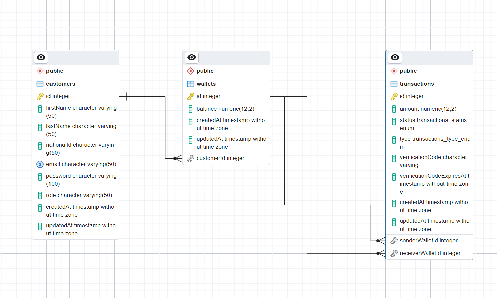

# Description of the MVP project (Tekana-eWallet)

Imagine that you are appointed to lead a team of engineers to revamp a legacy
application that is used worldwide by customers to transfer money.
For the sake of this test, the application is called “Tekana-eWallet”
The tech team is composed of back-ends, front ends, UI, UX designers and product
owner as well as a Scrum Master. The business team is also there to help with the
requirements as subject matter experts.

## Goal of the Project

rebuild from scratch a back-end solution for a legacy platform that
serves 1 million customers around the world. The MVP solution will have a list
of minimum features as listed

  - Create, Read customers (Registration)

  - Create and read wallets of customers

  - Create and read transactions.

## Key Tech Stack 

  - [Nest js](https://nestjs.com/) A progressive Node.js framework for building efficient, reliable and scalable server-side applications.

  - [PostgreSQL](https://www.postgresql.org/) a powerful, open source object-relational database system with over 35 years of active development that has earned it a strong reputation for reliability, feature robustness, and performance.

  - [pnpm Package manager](https://pnpm.io/) pnpm is widely believed to be  up to 2x faster than the alternatives yarn and npm hence I opted for its usage 

  - [Swagger](https://swagger.io/) an open source set of rules, specifications and tools for developing and describing RESTful APIs. The Swagger framework allows developers to create interactive, machine and human-readable API documentation.

## Strategy 

  Obviously this being a MVP, it does not pack all the features a complete E-wallat should have, the focus was to design a system to allow users to safely perfoem the main functions of
  an Ewallet - sending and receiving funds


  ### Database Design 

  The database is made of 3 tables, Customers, Wallets and Transactions as shown in the Entity Relationship Diagram illustration below:

   


  - ### Flow for new Users

    - New users must sign up to start using the E-wallet so the first logical step is to register into the sytem
    - After signing up they can now login using credentials they used while signing up
    - After that a user can create their own E-wallet so they can start sending and receiving money
    - After wallet creation they can start enjoying sending and receiving freely using Tekana Ewallet
  
  - ### APIs for Tekana E-wallet

   

| method             | resource         | description                                                                                    |
|:-------------------|:-----------------|:-----------------------------------------------------------------------------------------------|
| `POST`             | `api/v1/auth/register`         | Registration a new customer                                      |
| `POST`             | `api/v1/auth/login`     | Authentication of a  customer                   |
| `GET` (protected)       | `api/v1/customers`         | return lists of customers with pagination to handle large data sets who are registered in the system (only accessed by authenticated and admin user)               |
| `GET` (protected)       | `api/v1/customers/:id`     | return single customer details                    |
| `POST` (protected)      | `api/v1/wallets`         | creates a wallet for the customer who is authenticated          |
| `GET` (protected)       | `api/v1/wallets`     | return lists of all wallets with pagination to handle large data sets who are registered in the system (only accessed by authenticated and admin user)        |
| `PUT` (protected)       | `api/v1/wallets/:id`     | For updating wallet information for the authenticated user        |
| `POST` (protected)      | `api/v1/wallets/direct-deposit`         | As a way to load funds into a wallet (different from in-app transfering/receiving)  (performed by authenticated user on own wallet)                   |
| `POST` (protected)       | `api/v1/transactions`         | Initiates a transaction record with 'pending' status awaiting confirmation but funds are temporarily removed from sender wallet          |
| `GET` (protected)       | `api/v1/transactions`     | return all transactions with pagination to handle large data sets who are registered in the system (only accessed by authenticated and admin user)     | 
| `GET` (protected)       | `api/v1/transactions/:id`     | return authenticated user's wallet details     | 
| `PATCH` (protected)       | `api/v1/transactions/complete-transaction`     | submits transaction verification code and if succesfull sets transaction status to 'completed' and finally adds funds to receiving wallet     | 


  - ## Key Business considerations & Architecture design choices

    - Customer can not perform any other action besides registering and loging in when unauthenticated
    - User are given a default role upon sign up (standard) this is to limit what resources regular customers can access (designed with getting ALL transactions/wallets/customers APIs in mind)
    - When creating a wallet for authenticated user an initial balance is set for future transfers/receivings
    - A customer can directly deposit into own wallet as a way to load funds in wallet (similar to transfter from Bank to own momo wallet) (this was done for testing purposes)
    - Upon transaction, authenticated user submits object with senderWalletId (has to match authenticated user wallet id) otherwise forbidden, he/she also submits receiver walletId and amount
    - Systems checks if sender wallet has enough funds (remaining balance after said transaction has to be over 500.00) 
    - If sender wallet has enough funds a transaction is initiated with 'pending' status and verification code that expires 5 minutes from transaction createdAt time stamp
    - the funds are deducted from sender walllet but NOT disbursed to receiving wallet as the transaction awaits confirmation (ideally to be sent to sender wallet customer's phone but this is not implemented)
    - To complete transaction authenticated user has to send request with verificationCode the format being for ex:(TRSFR-435678)
    - Systems checks if said transaction is still pending and still has non-expired verification code
    - if verification code has expired the transaction fails with message to customer that the verification code is invalid or expired
    - if verification code is valid but status is not 'pending' the transaction fails as it could mean transaction has already been completed (customer advised to contact support)
    - if verification code is valid and status is 'pending' the transaction is updated to completed and funds are now disbursed to reciever wallet
    - A cron job that runs every 7 hours checking for 'failed' or 'pending' transactions whose verification codes expired (basically transfers that did not go through)
    - the cron loads them in chunks (as they could be many) and reverses each transaction by refunding the sender wallet and updating transaction status to 'refunded'
    - Transacations controller methods are rate limited to 50 requests/min per client as it the most sensitive domain of the application


 

  ### How to Run

1. In the terminal run the following commands

  - Clone the repository

  ```
  git clone https://github.com/hugues0/tekana-ewallet.git
  ```

  - CD into the project by running

  ```
  cd tekana-ewallet
  ```

  - install pnpm if not installed by running

  ```
  npm install -g pnpm
  ```

  - install all project packages with pnpm by running

  ```
  pnpm install
  ```

  - set enviroment variables (look for ```.env.example``` file for needed .env variables to run the project and keep in mind the project uses postgreSQL)

  - run the local development server by running

  ```
  pnpm run start:dev
  ```

  - After the server has started, the documentation can be found on the following URL (provided your APP_PORT in .env is 5002)

  ```
  http://localhost:5002/docs#/
  ```


**Enjoy Tekana-ewallet features**
 

# **Author**

## **NTWARI Hugues**